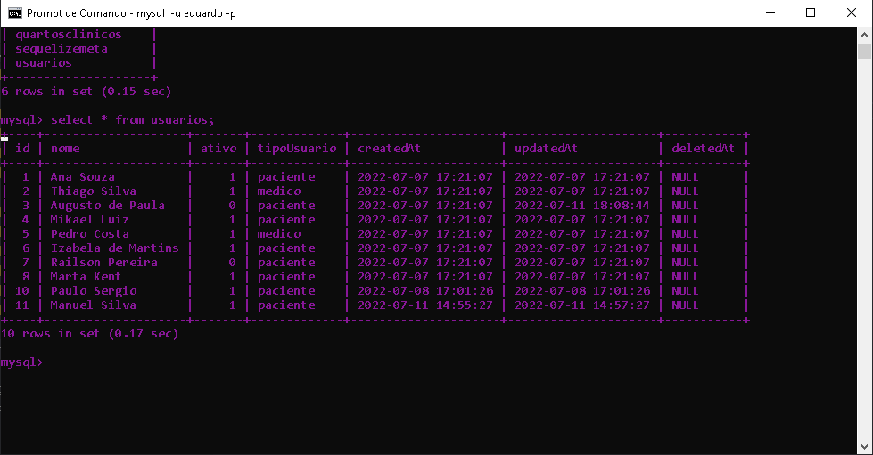

HospitalAPI - api que faz o gerenciamento de um sistema hospitalar, utiliza a arquitetura mvc, tem como função cadastrar pacientes e medicos, criar cadastros de pacientes, com estágios hospitalares e quartos clinicos com seus medicos designados, realiza CRUD com softDelete, restauração de registros e busca por apenas registros ativos. Tal projeto utiliza as tecnologias: JavaScript(Linguagem), Node.js(Ambiente de execução), Mysql(Banco de dados), Sequelize(ORM) e Express(Framework).

  
    
    
    
       

